# Planejamento Financeiro
`Projeto Futurizando | CIÊNCIAS DA COMPUTAÇÃO | 1° Semestre/2023 `

## Participantes
* Arthur Braga de Campos Tinoco  
* Cecília Fernandes Silva Costa
* David Gomes Vieira
* Guilherme Meyer Guimarães
* Henrique Guimarães e Silva
* Henrique Lima da Cunha Pereira

# Estrutura do Documento

- [Informações do Projeto](#informações-do-projeto)
  - [Participantes](#participantes)
- [Estrutura do Documento](#estrutura-do-documento)
- [Introdução](#introdução)
  - [Problema](#problema)
  - [Objetivos](#objetivos)
  - [Justificativa](#justificativa)
  - [Público-Alvo](#público-alvo)
- [Especificações do Projeto](#especificações-do-projeto)
  - [Personas, Empatia e Proposta de Valor](#personas-empatia-e-proposta-de-valor)
  - [Histórias de Usuários](#histórias-de-usuários)
  - [Requisitos](#requisitos)
    - [Requisitos Funcionais](#requisitos-funcionais)
    - [Requisitos não Funcionais](#requisitos-não-funcionais)
  - [Restrições](#restrições)
- [Projeto de Interface](#projeto-de-interface)
  - [User Flow](#user-flow)
  - [Wireframes](#wireframes)
- [Metodologia](#metodologia-e-divisão-de-papeis)
  - [Divisão de Papéis](#metodologia-e-divisão-de-papeis)
  - [Ferramentas](#ferramentas)
  - [Controle de Versão](#controle-de-versão)
- [**############## SPRINT 1 ACABA AQUI #############**](#-sprint-1-acaba-aqui-)
- [Projeto da Solução](#projeto-da-solução)
  - [Tecnologias Utilizadas](#tecnologias-utilizadas)
  - [Arquitetura da solução](#arquitetura-da-solução)
- [Avaliação da Aplicação](#avaliação-da-aplicação)
  - [Plano de Testes](#plano-de-testes)
  - [Ferramentas de Testes (Opcional)](#ferramentas-de-testes-opcional)
  - [Registros de Testes](#registros-de-testes)
- [Referências](#referências)

# Introdução

## Problema

Sob o contexto vivenciado na economia e na população brasileira, durante os últimos 10 anos, viu-se muito da subvalorização do Real sobre os demais produtos/artigos comprados diariamente, como alimentos, vestuário, equipamentos eletrônicos, entre outros. Gastos considerados essenciais, como água, luz, moradia, aluguel, plano de saúde, subiram a um ritmo gritante, durante esse período, o que ocasionou em um amplo endividamento da população, principalmente às classes mais carentes.

## Objetivos

Como matriz do nosso projeto, pretendemos desenvolver uma aplicação web, de certa forma parecida com as funcionalidades do "Microsoft Excel", afim de prover, de forma responsiva e direta, um planejamento personalidade e atento às necessidades do usuário, seja quais forem as demandas, além como forma de compreensão sobre as finanças próprias, quais urgências atender e o que pode ser deixado para uma futura compra.

## Justificativa

É de grande comoção o momento atual que o país passa, sobretudo economicamente, em que o custo de vida nunca esteve tão alto como nesse momento, durante os últimos 10 anos. Desta forma, como proposta envolvida a área da computação, pode ser visto uma possibilidade de concentrar esforços sobre esses indivíduos, afim de amenizar os impactos gerados pela alta dos juros, inflação alta e desvalorização do salário mínimo, contribuindo não apenas com a população endividada, quanto também uma possibilidade de informar e perpetuar boas práticas de educação financeira.

## Público-Alvo

Para este projeto, é de total interesse do grupo no foco ao atendimento de 3(três) públicos-alvos, sendo esses: **pessoas com baixa renda, pessoas com dificuldade em gerir o próprio dinheiro e pessoas consumistas**. Desta forma, podemos capacitar à cada grupo, com experiências personalizadas às suas necessidades, formatos e soluções para retirar esses individuos do endividamento, criação de um fundo de emergência, opções de investimentos, sugestão de compra com base no histórico, dentre outros.
 
# Especificações do Projeto

A partir daqui, será utilizado as ferramentas e propriedades do Design Thinking para filtrar as personas, como parâmetros de proposta de valor, além de entrevistas com potenciais usuários e feedbecks interativos que ajudam a esclarecer ideias.

## Personas, Empatia e Proposta de Valor
* Para melhor explicação e detalhamento, acesse o link do Design Thinking realizado na plataforma Miro: https://miro.com/app/board/uXjVMYCYaT4=/
> **Persona 1 - Carlos**
> 
> 
> 
> **Persona 2 - Maria Clara**
> 
> .png)
> 
> **Persona 3 - Erick**
> 
> .png)

## Histórias de Usuários

Com base na análise das personas forma identificadas as seguintes histórias de usuários:

|EU COMO... `PERSONA`| QUERO/PRECISO ... `FUNCIONALIDADE` |PARA ... `MOTIVO/VALOR`                 |
|--------------------|------------------------------------|----------------------------------------|
|Carlos  | Agilidade em organizar finanças           | Não esquecer de fazê-las               |
|Carlos       | Alertas sobre gastos                 | Evitar que haja excesso nas contas mensais |
|Carlos       | Planejar as férias                 | Permitir que haja uma economia adequada durante o ano |
|Maria Clara       | entender melhor o mercado financeiro                 | investir e conseguir uma renda a mais com certa segurança |
|Maria Clara      | ter mais opção na hora de pagar                 | Não ficar encurralada sobre possíveis multas com juros altos |
|Maria Clara       | Planejar suas compras                 | Gradualmente ir comprando, com base na prioridade e valor, aquilo que é de seu interesse|
|Erick      | Gastar menos                 | Não se manipular e ficar sem nada no fim do mês |
|Erick      | Praticidade em implementar suas finanças                 | Não ficar agarrado e ter uma facilidade em entender seu dinheiro na hora de organizar |

## Requisitos

As tabelas que se seguem apresentam os requisitos funcionais e não funcionais que detalham o escopo do projeto.

### Requisitos Funcionais

|ID    | Descrição do Requisito  | Prioridade |
|------|-----------------------------------------|----|
|RF-001| Cadastro do usuário | ALTA | 
|RF-002| Permitir que o usuário personalize suas necessidades | ALTA |
|RF-003| Informações sobre a entrada/saída de dinheiro   | ALTA |
|RF-004| Alertas de gasto excessivos/dicas para controle  | ALTA |
|RF-005| XXXX   | MÉDIA |
|RF-006| Lista de desejos/planejador de sonhos   | MÉDIA |
|RF-007| Acesso a investimentos e informações simplificadas sobre o mercado financeiro   | MÉDIA |
|RF-008| Formatos de Pagamentos   | BAIXO |
|RF-009| Arquitetura de Gráficos  | MÉDIO |
|RF-010| XXXX   | XXXX |
|RF-011| XXXX   | XXXX |
|RF-012| XXXX   | XXXX |

### Requisitos não Funcionais

|ID     | Descrição do Requisito  |Prioridade |
|-------|-------------------------|----|
|RNF-001| O algortimo deve planejar quais as prioridades daquele indivíduo  | ALTA |
|RNF-002| O sistema deve ser responsivo para rodar em um dispositivos móvel | MÉDIA |
|RNF-003| Automatizar o processo de verificação para entrada/saída de capital | MÉDIA |
|RNF-004| Interconexão com diversos formatos de investimentos para atender casos diversos de usuários | MÉDIA |
|RNF-005| Sugerir correções/reclamações sobre planejamentos/processos mal-executados/desconforme à necessidade do usuário | MÉDIA |
|RNF-006| Deve processar requisições do usuário em no máximo 3s |  BAIXA | 

## Restrições

O projeto está restrito pelos itens apresentados na tabela a seguir.

|ID| Restrição                                             |
|--|-------------------------------------------------------|
|01| O projeto deverá ser entregue até o final do semestre |
|02| Não pode ser desenvolvido um módulo de backend        |
|03| O projeto deve servir como guia, não educador     |
|04| Não deve ocorrer aporte financeiro sobre a aplicação  |
|05| A aplicação não deve induzir o usuário ao erro ou perda de capital        |

# Projeto de Interface

Para concretizar na solução da aplicação, deve-se buscar atender, com responsabilidade e compromisso, à necessidade do usuário, sobretudo se sua ideia for sair do vermelho ou expandir a forma de ganhar dinheiro e planejar como será feito. Assim, é necessário que o usuário forneça seus dados, como renda aproximada, principais gastos e seus custos, além de pesquisas comportamentais para definir como esse usuário deverá ser guiado durante o percurso na aplicação. Capacitar a entrada/saída de capital para compreender o quanto foi gasto, se está dentro de suas economias e alertar o mesmo quando passar do limite, além de alertar quando alguma conta essencial estiver próxima a vencer. Garantir acesso integral a investimentos, orientando da melhor forma, quais são as melhores opções, a possibilidade de retorno, e muito mais.

## User Flow
> 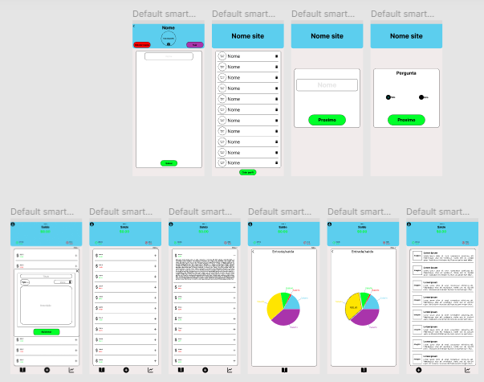

## Wireframes 

> 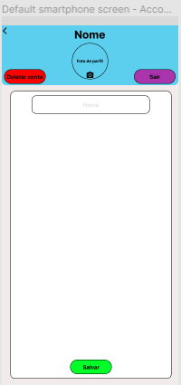
> 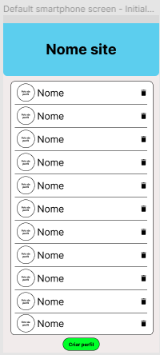
> 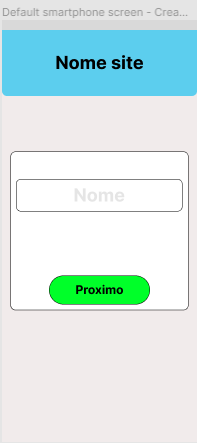
> 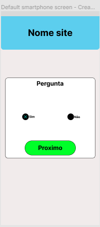
> 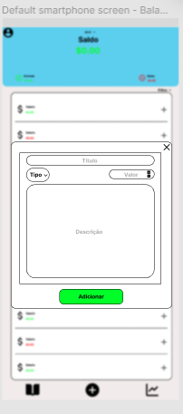
> 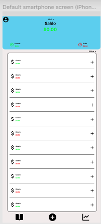
> 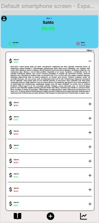
> 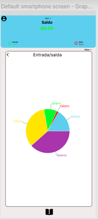
> 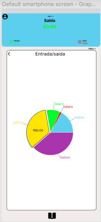
> 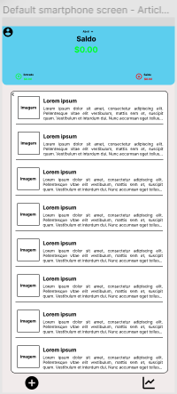

# Metodologia e Divisão de Papeis

Para divisão do trabalho, é decidido que o componente `Henrique Lima da Cunha Pereira` seja o Scrum Master, tendo a liderança sobre o projeto e buscando a motivação do grupo como um todo para a produção da solução da problemática. Como Product Owner, ficou acordado que o componente `Cecília Fernandes Silva Costa` tomasse por essa parte, coordenando as tarefas registrando-as no site *Trello*. Os desenvolvedores, por fim, serão os componentes `Arthur Braga de Campos Tinoco`, `David Gomes Vieira`, `Guilherme Meyer Guimarães` e `Henrique Guimarães e Silva`, responsáveis pela formatação e estruturação da aplicação web a ser desenvolvida no semestre.

Link do site: https://trello.com/b/45zMzF7W/área-de-trabalho

## Ferramentas

| Ambiente  | Plataforma              |Link de Acesso |
|-----------|-------------------------|---------------|
|Processo de Design Thinkgin  | Miro | https://miro.com/app/board/uXjVMYCYaT4=/ |
|Repositório de código | GitHub | https://github.com/ICEI-PUC-Minas-PPLCC-TI/ti-1-ppl-cc-m2-20231-planejamento-financeiro/tree/master/codigo | 
|Protótipo Interativo | Figma | https://www.figma.com/file/t2Q10paPmVpPQvPUGNZHgO/Untitled?node-id=0%3A1&t=5St5OME1WnknA65k-1 |
| Apresentação do grupo | Canva | https://www.canva.com/design/DAFgliD4tRo/91ohZSLe3EDAVMoGCV5XUg/edit?utm_content=DAFgliD4tRo&utm_campaign=designshare&utm_medium=link2&utm_source=sharebutton |
| Divisão de tarefas | Trello | https://trello.com/b/45zMzF7W/área-de-trabalho |
| Hospedagem do site | GitHub Pages | *pendente* | 
| Ferramente de comunicação | WhatsApp |  |
| Editor do Código | Visual Studio Code | |

## Controle de Versão

A ferramenta de controle de versão adotada no projeto foi o Git, sendo que o Github foi utilizado para hospedagem do repositório `Planejamento Financeiro`.

> O projeto segue a seguinte convenção para o nome de branchs:
> 
> - `master`: versão estável já testada do software
> - `unstable`: versão já testada do software, porém instável
> - `testing`: versão em testes do software
> - `dev`: versão de desenvolvimento do software
> 
> Quanto à gerência de issues, o projeto adota a seguinte convenção para
> etiquetas:
> 
> - `bugfix`: uma funcionalidade encontra-se com problemas
> - `enhancement`: uma funcionalidade precisa ser melhorada
> - `feature`: uma nova funcionalidade precisa ser introduzida

# **############## SPRINT 1 ACABA AQUI #############**

# Projeto da Solução

......  COLOQUE AQUI O SEU TEXTO ......

## Tecnologias Utilizadas

......  COLOQUE AQUI O SEU TEXTO ......

> Descreva aqui qual(is) tecnologias você vai usar para resolver o seu
> problema, ou seja, implementar a sua solução. Liste todas as
> tecnologias envolvidas, linguagens a serem utilizadas, serviços web,
> frameworks, bibliotecas, IDEs de desenvolvimento, e ferramentas.
> Apresente também uma figura explicando como as tecnologias estão
> relacionadas ou como uma interação do usuário com o sistema vai ser
> conduzida, por onde ela passa até retornar uma resposta ao usuário.
> 
> Inclua os diagramas de User Flow, esboços criados pelo grupo
> (stoyboards), além dos protótipos de telas (wireframes). Descreva cada
> item textualmente comentando e complementando o que está apresentado
> nas imagens.

## Arquitetura da solução

......  COLOQUE AQUI O SEU TEXTO E O DIAGRAMA DE ARQUITETURA .......

> Inclua um diagrama da solução e descreva os módulos e as tecnologias
> que fazem parte da solução. Discorra sobre o diagrama.
> 
> **Exemplo do diagrama de Arquitetura**:
> 
> 

# Avaliação da Aplicação

......  COLOQUE AQUI O SEU TEXTO ......

> Apresente os cenários de testes utilizados na realização dos testes da
> sua aplicação. Escolha cenários de testes que demonstrem os requisitos
> sendo satisfeitos.

## Plano de Testes

......  COLOQUE AQUI O SEU TEXTO ......

> Enumere quais cenários de testes foram selecionados para teste. Neste
> tópico o grupo deve detalhar quais funcionalidades avaliadas, o grupo
> de usuários que foi escolhido para participar do teste e as
> ferramentas utilizadas.
> 
> **Links Úteis**:
> - [IBM - Criação e Geração de Planos de Teste](https://www.ibm.com/developerworks/br/local/rational/criacao_geracao_planos_testes_software/index.html)
> - [Práticas e Técnicas de Testes Ágeis](http://assiste.serpro.gov.br/serproagil/Apresenta/slides.pdf)
> -  [Teste de Software: Conceitos e tipos de testes](https://blog.onedaytesting.com.br/teste-de-software/)

## Ferramentas de Testes (Opcional)

......  COLOQUE AQUI O SEU TEXTO ......

> Comente sobre as ferramentas de testes utilizadas.
> 
> **Links Úteis**:
> - [Ferramentas de Test para Java Script](https://geekflare.com/javascript-unit-testing/)
> - [UX Tools](https://uxdesign.cc/ux-user-research-and-user-testing-tools-2d339d379dc7)

## Registros de Testes

......  COLOQUE AQUI O SEU TEXTO ......

> Discorra sobre os resultados do teste. Ressaltando pontos fortes e
> fracos identificados na solução. Comente como o grupo pretende atacar
> esses pontos nas próximas iterações. Apresente as falhas detectadas e
> as melhorias geradas a partir dos resultados obtidos nos testes.

# Referências

......  COLOQUE AQUI O SEU TEXTO ......

> Inclua todas as referências (livros, artigos, sites, etc) utilizados
> no desenvolvimento do trabalho.
> 
> **Links Úteis**:
> - [Formato ABNT](https://www.normastecnicas.com/abnt/trabalhos-academicos/referencias/)
> - [Referências Bibliográficas da ABNT](https://comunidade.rockcontent.com/referencia-bibliografica-abnt/)
